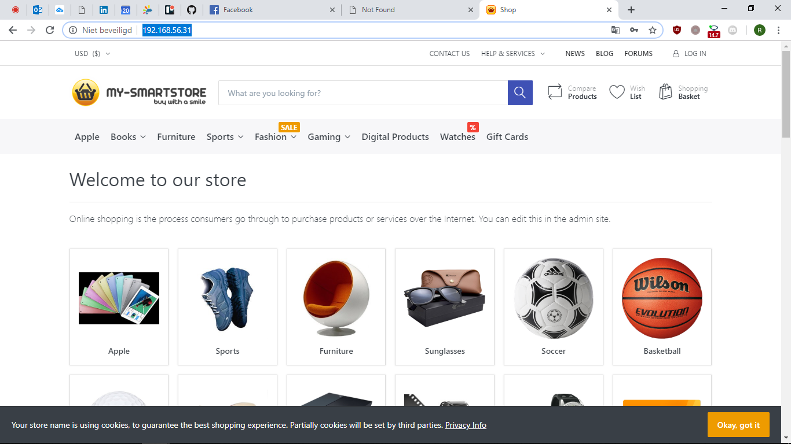

# Testrapport taak 1: (titel)
## 1: Server init
"Vagrant up" uitgevoerd, zodat het .ps1 script alle software installeerde.  

## 2: ASP.NET app installatie 
Gesurft naar http://192.168.56.31/install  
Screenshots uit documentatie gevolgd voor invullen van smartstore fields.  
Gebruikt wachtwoord was root  

## 3: Bezoeken van de server met je browser in je OS

## 4: Testen de database door creatie van een user

Ik ben succesvol in en Uitgelogd als gebruiker "LEL" met eigen paswoord.

## Test 1
Uitvoerder(s) test: Robin Boone
Uitgevoerd op: 24/03/2019  
puntje 4 uitgevoerd op 25/03/2019