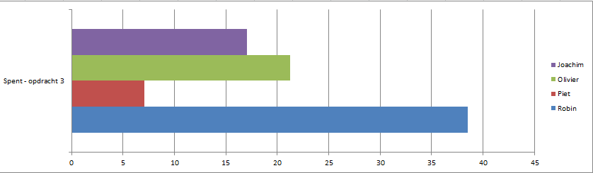
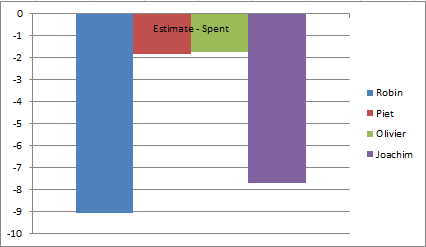

# Lastenboek 

## Deliverables

1. Verslagen overleg vastgoedgroepen
2. Twee verschillende offertes per vastgoedgroep
3. Logische topologie packettracer
4. Fysieke topologie opstelling
5. Presentatie voor klant
6. Handleidingen klanten
7. Lastenboek

## Deeltaken per deliverable

### 1. Verslagen overleg vastgoedgroepen
* Overleg
    - Verantwoordelijke: Robin, Piet, Olivier, Joachim
* Verslag overleg groep 2
    - Verantwoordelijke: Robin
    - Tester: Olivier
* Verslag overleg groep 16
    - Verantwoordelijke: Robin
    - Tester: Olivier
 * Mails vastgoedgroepen (bijkomend overleg)
    - Verantwoordelijke: Robin 
    - Tester: Piet, Olivier, Joachim

### 2. Twee verschillende offertes per vastgoedgroep  
Afhankelijk van :   1  
* Twee offertes - groep 2
    - Verantwoordelijke: Olivier
    - Tester: Joachim
* Twee offertes - groep 16
    - Verantwoordelijke: Olivier
    - Tester: Joachim  

### 3. Logische topologie packettracer  
Afhankelijk van:    1  
* Netwerkopstelling packettracer - groep 2
    - Verantwoordelijke: Robin
    - Tester: Joachim
* Netwerkopstelling packettracer - groep 16
    - Verantwoordelijke: Robin
    - Tester: Joachim
* Documentatie opstelling - groep 2
    - Verantwoordelijke: Robin
    - Tester: Joachim
* Documentatie opstelling - groep 16
    - Verantwoordelijke: Robin
    - Tester: Joachim
* Testplan
    - Verantwoordelijke: Robin
    - Tester: Joachim

### 4. Fysieke topologie opstelling
Afhankelijk van:    1,3  
* Testplan
    - Verantwoordelijke: Robin
* Fysieke netwerkopstelling
    - Verantwoordelijke: Robin, Piet, Joachim
    - Tester: Robin, Piet, Joachim

### 5. Presentatie voor klant
Afhankelijk van:    1,2,3  
* Powerpoint
    - Verantwoordelijke: Olivier, Joachim
    - Tester: Robin
* Presentatie voorbereiden
    - Verantwoordelijke: Robin, Piet, Olivier, Joachim
* Presentatie geven
    - Verantwoordelijke: Robin, Piet, Olivier, Joachim
* Offertes en powerpoint mailen naar klant
    - Verantwoordelijke: Robin, Joachim
    - Tester: Olivier

### 6. Handleidingen klanten
Afhankelijk van:    1,2,3  
* Handleiding groep 2
    - Verantwoordelijke: Joachim
    - Tester: Robin
* Handleiding groep 16
    - Verantwoordelijke: Joachim
    - Tester: Robin

### 7. Lastenboek
Afhankelijk van: 1,2,3,4,5,6  
* Lastenboek
    - Verantwoordelijke: Robin

## Tijdbesteding

| Student    | Geschat | Gerealiseerd |
| :---       | ---:    | ---:         |
| Robin Boone   |    29.49    |      38.49         |
| Piet Jacobs   |    5.25     |      7.1        |
| Olivier Troch   |  19.5       |       21.25       |
| joachim van de keere   |    9.3     |     17.05         |
| **totaal** |     63.46    |    83.89          |

  

